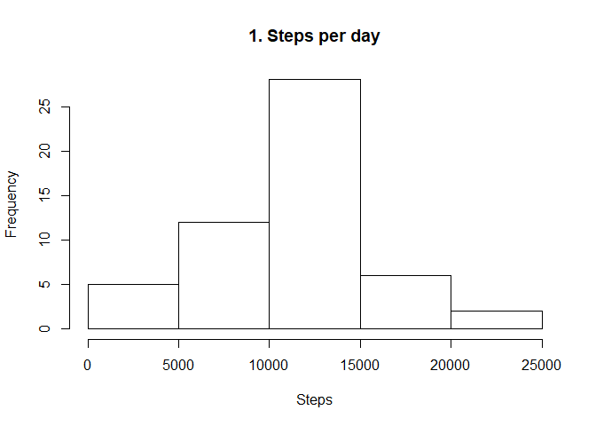
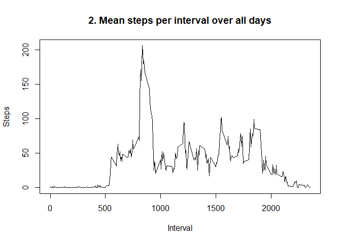
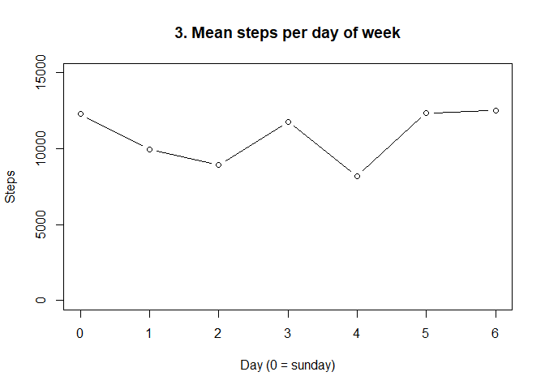
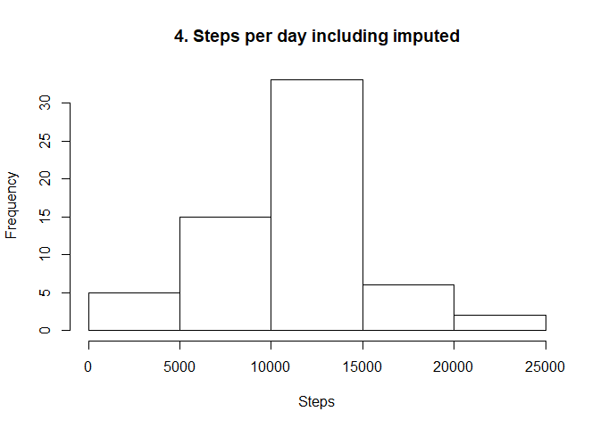
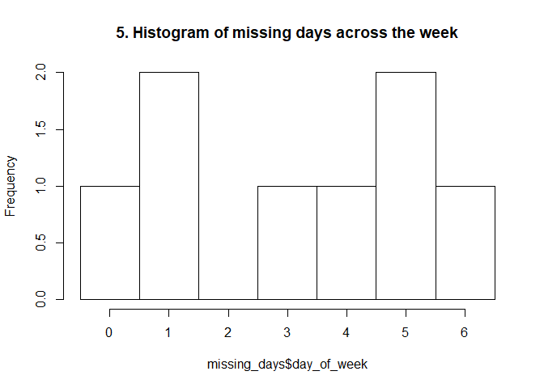
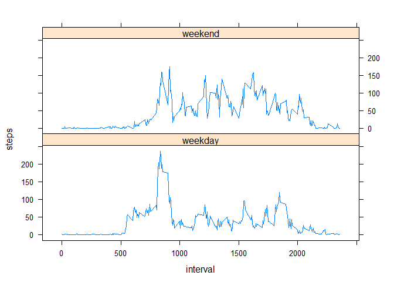

### Analysis of step measurements from a personal activity monitor  
by Isha Lamboo

project forked from Roger D. Peng's GitHub project for this assignment
at [https://github.com/rdpeng/RepData_PeerAssessment1]

## Loading and preprocessing the data

The source data is included in the project in the file activity.zip
Steps taken include unzipping, reading in the csv file, converting the dates and formatting the intervals.

For the analysis, weekdays are also calculated using the as.POSIXlt() function to get
day of week (0-6 starting on sunday) independent of locale.  
Next, Factor variable is calculated with day_of_week 0 and 6 as weekend, the rest as weekday.
Finally, a clean copy of the dataset without missing values is created for easy analysis.


```r
# load library but suppress status messages
library(dplyr)
library(lattice)
```


```r
unzip('activity.zip','activity.csv')
raw_data <- read.csv('activity.csv',na.strings = 'NA',stringsAsFactors = FALSE)
activity_data <- raw_data %>% tbl_df() %>% 
  mutate(date=as.Date(date,format="%Y-%m-%d")) %>% 
  mutate(interval_time=sub('^(.{2})(.*)$', '\\1:\\2',as.character(formatC(interval, width=4,flag = "0")))) %>%
  mutate(day_of_week=as.POSIXlt(date)$wday) %>% 
  mutate(week_or_weekend=as.factor(case_when(is.na(day_of_week) ~ "NA", day_of_week==0 ~ "weekend", day_of_week==6 ~ "weekend", TRUE ~ "weekday")))

clean_data <- filter(activity_data,!is.na(steps)) 
```


## What is mean total number of steps taken per day?

The observations are in 5 minute intervals, so to get the mean per day, they need to be summed by date first.  Note: day_of_week is kept in the group_by for later use.


```r
steps_per_day <- clean_data %>% group_by(day_of_week,date) %>% summarize(steps=sum(steps))

mean_steps <- round(mean(steps_per_day$steps),0)
median_steps <- round(median(steps_per_day$steps),0)
```
The mean number of steps per day = 10766  
The median number of steps per day = 10765


```r
hist(steps_per_day$steps,main = "1. Steps per day",xlab="Steps")
```

<!-- -->


## What is the average daily activity pattern?

The clean data is grouped by interval and the mean calculated.
Next the peak interval is identified.


```r
steps_per_interval <- group_by(clean_data,interval) %>% summarize(steps=mean(steps))

peak_interval <- steps_per_interval[[which.max(steps_per_interval$steps),1]]
```

The interval with the highest mean steps is 835 or in time notation: 08:35

The following chart shows the number of steps in 5 minute intervals averaged over all days in the dataset.
The intervals are identified by their starting time in 24-hour clock time. This is kept as a numeric value to allow for plotting the timeseries. Ex.: A value of 500 translates to 05:00.


```r
plot(x = steps_per_interval$interval, y = steps_per_interval$steps,type="l",main="2. Mean steps per interval over all days",xlab="Interval",ylab="Steps")
```

<!-- -->


## Imputing missing values

Using the original activity_data variable, calculate the number of missing values.
Note: missing_days is calculated for the comparison further on.


```r
missing_count <- activity_data %>% filter(is.na(steps)) %>% nrow()
missing_days <- activity_data %>% filter(is.na(steps)) %>% group_by(day_of_week, date) %>% summarize(n())
```

There are 2304 missing/empty observations.

To impute them, it makes sense to take the mean value of the interval as there is a clear daily routine visible in the previous plot.  

To investigate if there is also a clear weekly pattern to take into account, the mean values per day of week are calculated and plotted using the steps_per_day variable: 

```r
steps_per_dow <- steps_per_day %>% group_by(day_of_week) %>% summarize(steps=mean(steps))
```


```r
plot(x = steps_per_dow$day_of_week, y = steps_per_dow$steps,type="b",main="3. Mean steps per day of week",xlab="Day (0 = sunday)",ylab="Steps",ylim=c(0,15000))
```

<!-- -->

Here too there is a lot of difference between the days, with a noticeable dip on day 4 (thursday). Despite the low number of observations (53 days with complete observations) it seems reasonable to take into account the day of week for the imputation of the missing values from the clean_data dataset.

The impute_values variable is used to store the mean number of steps for all combinations of day_of_week and interval present in the clean_data set.


```r
impute_values <- clean_data %>% group_by(day_of_week,interval) %>% summarize(imputed_steps=as.integer(mean(steps)))
```

The values are joined to the main dataset and the values of steps replaced if missing.


```r
activity_imputed <- activity_data %>% 
  left_join(impute_values, by=c("day_of_week","interval")) %>% 
  mutate(steps=case_when(is.na(steps) ~ imputed_steps, TRUE ~ steps)) %>% 
  select(-imputed_steps)
```

### Comparison

Using the new dataset, recalculate mean, median and histogram:


```r
steps_per_day2 <- activity_imputed %>% group_by(day_of_week,date) %>% summarize(steps=sum(steps))

mean_steps2 <- round(mean(steps_per_day2$steps),0)
median_steps2 <- round(median(steps_per_day2$steps),0)
```
The new mean number of steps per day = 10810, 0.41 percent higher than the first value of 10766  
The new median number of steps per day = 11015, 2.32 percent higher than 10765.  


```r
hist(steps_per_day2$steps,main = "4. Steps per day including imputed",xlab="Steps")
```

<!-- -->

### Impact of the imputation


```r
additional_days <- nrow(steps_per_day2)-nrow(steps_per_day)
expected_observations <- additional_days * 1440 / 5
```

There are 8 more days with observations in the completed data set. With 288 observations per day that accounts for 2304 out of 2304 missing observations. The missing values were clearly concentrated in those 8 days.  
The missing days were not evenly distributed across the week, as shown in plot 5 below.
This is significant, since the mean steps per day of week shows considerable variation (see plot 3)


```r
hist(missing_days$day_of_week,breaks=-0.5+0:7,main="5. Histogram of missing days across the week")
```

<!-- -->

The impact on the mean number of steps is minimal, which is expected since the imputed values are themselves based on the mean of the data set. The impact on the median is more pronounced. 

Both differences are explained by the unequal distribution of the missing days. Day 5 is represented twice and is well above the weekly average. (See plots 3 and 5.) 

## Are there differences in activity patterns between weekdays and weekends?

The activity_imputed dataset already has the factor variable for weekdays and weekends. It needs to be grouped by this variable and the interval to create timeseries for both.


```r
activity_wow <- activity_imputed %>% 
  group_by(week_or_weekend, interval) %>% 
  summarize(steps=mean(steps))
```

The final plot shows the difference in steps per 5 minute interval between weekdays and weekend days.


```r
with(activity_wow, xyplot(steps ~ interval | week_or_weekend, type="l", layout=c(1,2)))
```

<!-- -->
